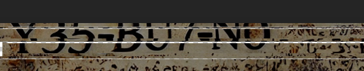

# Solution

STEP 0:

1. Fix the distorted image by doing some basic cut and paste operations.
   

OSINT TIME:

1. Run your favorite online username search tool and search for the username `y35-bu7-n0`.
2. You will find that the username is associated with the reddit account `u/y35-bu7-n0`.
3. Checking the comments of the user, you will find a comment on a post in the subreddit `r/chess` and `r/AnarchyChess`.
4. This reddit profile also contains the first part of the flag: `YBN{P@wn5_@re_1ike_k@rma_`.
5. Same username is also found on the chess website `chess.com` with the profile name `y35-bu7-n0`.
6. The profile contains the second part of the flag: `_5t@rt_sma1l_@nd_bui1d_up}`.

`YBN{P@wn5_@re_1ike_k@rma__5t@rt_sma1l_@nd_bui1d_up}`
