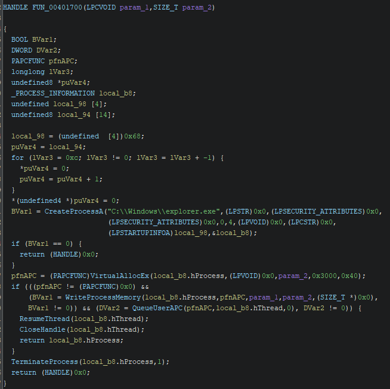
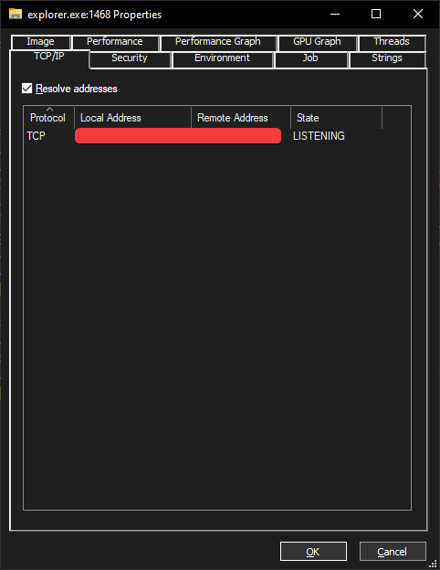
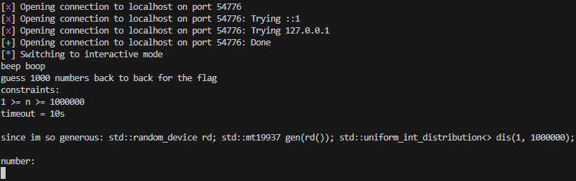

# Ghosted

### Notes
- Right off the bat we can infer that this is doing some sort of process injection with APCs.
- We can also notice that the binary is stripped. Cool.
- As of now the problem with `std::random_device` seems to have been fixed - See [this post](https://gcc.gnu.org/bugzilla/show_bug.cgi?id=85494). I've attached my compiler info as a clue.

## Static Analysis
1. Open this up in Ghidra.
2. Looking at its imports, we can see suspicious functions being imported, i.e `QueueUserAPC`, `CreateProcessA`, `VirtualAllocEx`, `WriteProcessMemory`, `ResumeThread`.
3. Let's see what this is doing with `CreateProcessA` - do these imports ring any bells? It's [Early Bird APC Code Injecton](https://www.ired.team/offensive-security/code-injection-process-injection/early-bird-apc-queue-code-injection).
4. Go to `CreateProcessA`'s XREFs, and jump to where it's referenced in code.
5. Looks like it's going to perform injection onto an `explorer.exe` instance it creates.


## Dynamic Analysis
1. Run the binary (preferably in a VM, in this case I didn't put anything malicious but I wouldn't trust my code either.)
2. Notice that `explorer.exe` is listening for something via TCP? 

3. We can use TCPView to see what port it's listening to.

3. Let's connect to it using pwntools. (I don't have nc set up properly on my Windows machine)
```py
from pwn import *
p = remote("localhost", 54776) # port will differ for you
p.interactive()
```

4. Looks like it's just a number guessing game, probably C++ given `std::random_device` etc..
5. If you're familiar with randomness on Windows, you might already know that `std::random_device` has `entropy = 0` here. Let's write a small program to test that theory out.
```cpp
#include <iostream>
#include <random>
int main() 
{
    std::random_device rd;
    std::cout 
        << "Entropy of rd: " 
        << rd.entropy()
        << "\n";

    return EXIT_SUCCESS;
}

// Entropy of rd: 0
```
6. Great. We've established that the `std::random_device` has 0 entropy. How can we exploit this? 

## Solve
1. Create your own program to generate the random numbers. 
2. Since the challenge was kind enough to provide us the parameters used to create the numbers, we can write our own program to replicate it and generate the 1000 numbers we need.
```cpp
    std::random_device rd;
    std::mt19937 gen(rd());
    std::uniform_int_distribution<> dis(1, 1000000);

    std::vector<int> numbers;
    std::cout << "solutions = [\n";
    for (int i = 0; i < 1000; i++) {
        int rand = dis(gen);
        numbers.push_back(rand);
        std::cout << rand;
        if (i != 999) std::cout << ",";
        if (i % 10 == 9) std::cout << "\n";
    }
    std::cout << "]\n";
```
3. The above code will give us a list we can paste into our `pwntools` script.
4. Now, knowing the port, and the stream of numbers, we can use `pwntools` to blast the solution into the TCP server, and get our flag. (We have to be fast, since the challenge times out after waiting a while.)
5. Solve script:
```py
solutons = [...]

p = remote("localhost", 54776) # note: port is random, check TCPView
p.interactive()
p.recvuntil(b"generous:") # don't really care
for i in range(1000):
    print("now on: " + str(i))
    p.recvuntil(b"number:")
    p.sendline(str(solutions[i]).encode())

res = p.recvall()

print(res)
```
6. This should yield the flag nicely: `b' \ngood. 1000/1000\nenjoy flag: YBN24{D33Z_NUMB3RS_D0NT_CH4NG3_E1TH3R}\n'`